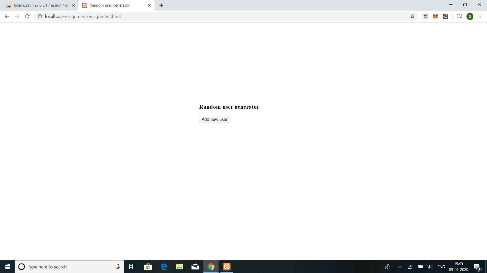
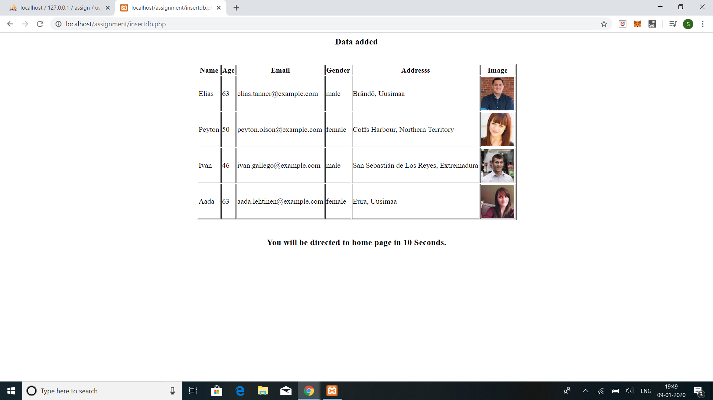
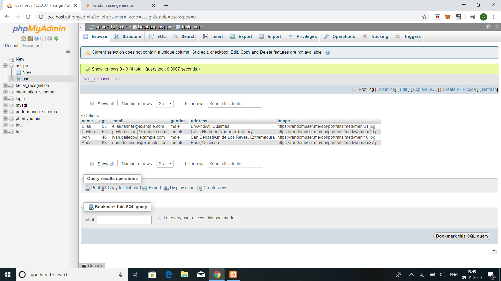

# random_user

# Installation

1>Install XAMPP or WAMPP.

2>Open XAMPP Control panal and start [apache] and [mysql] .

3>Download project from github(https://github.com/sanj-na/random_user.git).

4>extract files in C:\xampp\htdocs.

5> open link localhost/phpmyadmin

6>click on new at side navbar.

8>give a database name as (assign) hit on create button.

9> create a table name as (user) with name,age,email,gender,address,image columns. (I have used only varchar datatype for simplicity)

10>open any browser and type http://localhost/assignment.html.

# Screenshots

